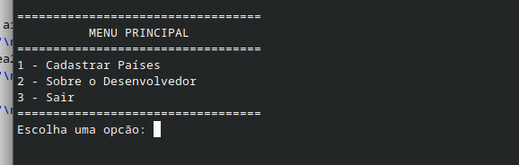
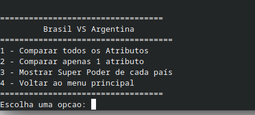
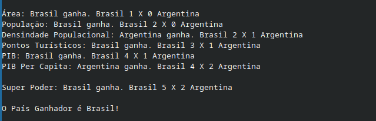
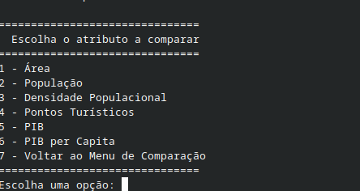

<h1>Cartas Países - Desenvolvendo a Lógica</h1>
Esse é meu segundo trabalho acadêmico da minha faculdade, e nele desenvolvi, utilizando como base o meu projeto anterior, menus interativos e funções de verificação de números. 

Esse é menu principal:

Esse é o menu após o usuário adicionar as informações dos dois países:

Esse é o texto que o programa retorna se o usuário escolher a opção 1 do menu comparação:

Esse é o menu caso o usuário opte por compara apenas um atributo:

Esse projeto foi, até o momento, o mais divertido de fazer, principalmente pela questão de um precisar usar e fazer várias funções
 
Utilizei a IDE Code::Blocks, e para executar e compilar o código, é necessário apenas baixar o projeto e executar o arquivo .cbp.
